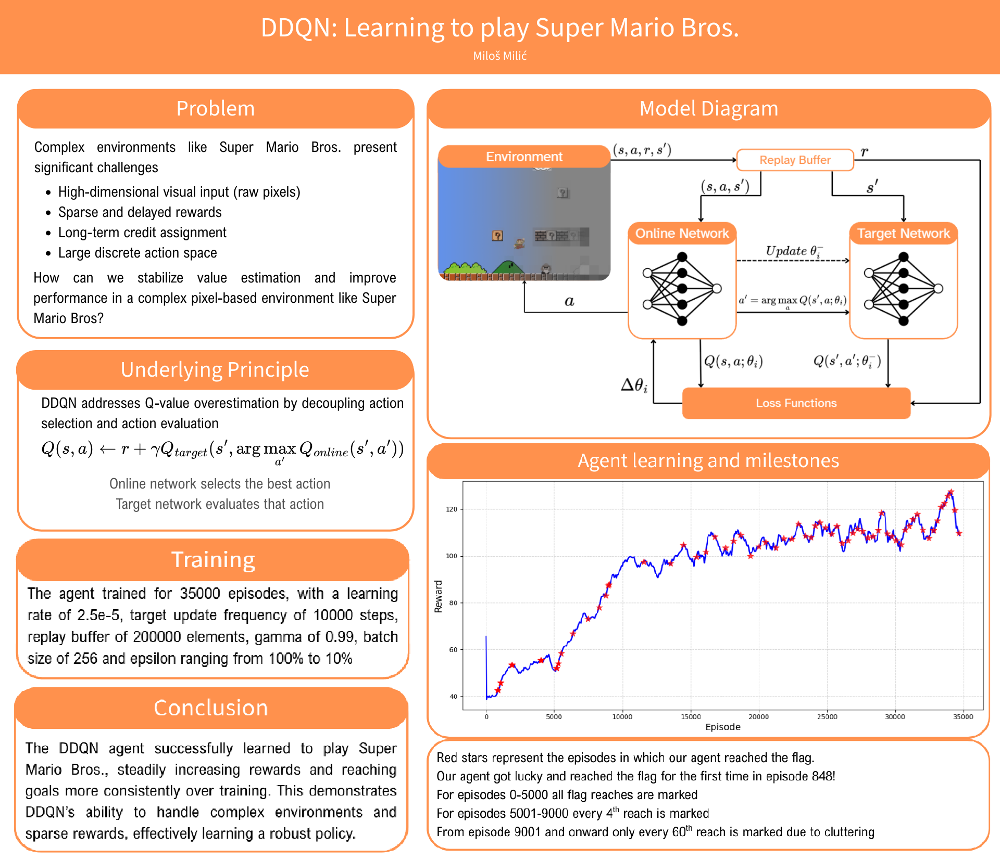
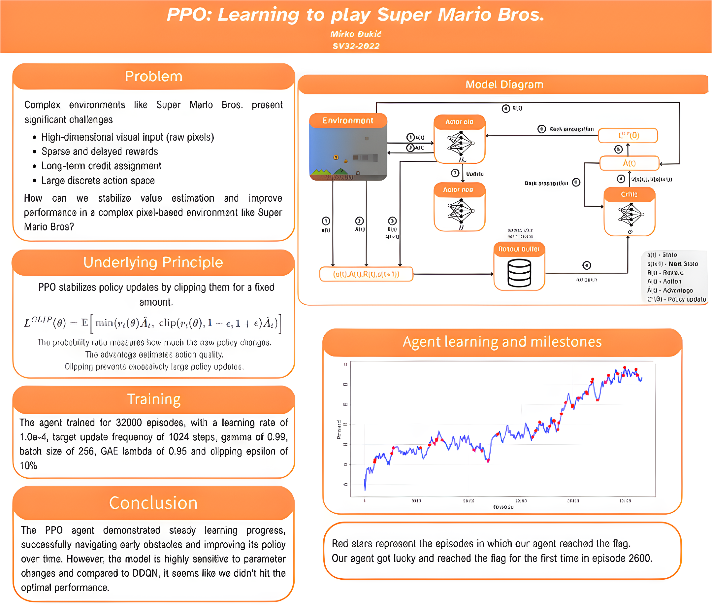

# Super-Mario-PPO-and-DQN-Reinforcement-learning

### **Tim**
- Mirko Đukić SV32/2022
- Miloš Milić SV10/2022

### **Asistenti**
- Aleksandra Kaplar
- Dragan Vidaković

### **Definicija problema**
Cilj projekta je treniranje AI agenta da prelazi nivo-e u 'Super mario Bros' koristeći reinforcement learning. Problem se sastoji u optimalnom učenju upravljanja likom na osnovu vizuelnog ulaza. Agent prima stanja okruženja u obliku slike i bira jednu od dozvoljenih akcija, te dobija i nagradu u zavisnosti od napretka. Formulacija zadatka je formulisana kao sekvencijalni problem udlučivanja u Markolijevom okruženju, gde se agent nagrađuje 

- Pomeranja desno
- Dosezanja zastave
- Kažnjavanja za smrt
- Time penalty za ohrabrivanje brze igre

### **Metodologija**
Za treniranje agenta koristimo DDQN i PPO. Agent uči iz vizuelnih ulaza igre, pri čemu će svaki frame biti obrađen sa

- Konverzijom u grayscale
- Skaliranje
- Normalizaciju piksela
- Slaganje više uzastopnih frame-ova radi očuvanja informacija

Stanje je tenzor dimenzija 4x84x84. 4 uzastopna frejma konvertovana u grayscale, smanjena na 84x84 i normalizovana na [0,1].

Koristimo CNN za ekstrakciju karakteristika iz slika. DDQN aproksimira funkciju na osnovu vrednosti akcije, PPO koristi actor-critic arhitekturu. Agent interaguje sa okruženjem krećući se, a nagrada će biti definisana na osnovu napretka u igri, preživljavanja, skupljanja coin-a..

Okruženje u kom agent trenira se zove 'gym-super-mario-bros'. Za treniranje neuronske mreže koristimo PyTorch.

'gym-super-mario-bros' emulator nam omogućava naredne akcije za koje Mario može da se opredeli:
- NOOP ( No operation)
- desno
- skok
- desno + skok
- desno + sprint
- desno+sprint+skok
- levo

### **Evaluacija**
Glavni kriterijumi preko kojih ćemo porediti DQN i PPO su:

- Success Rate: Procenat uspešnih prolazaka nivoa
- Learning Speed: Broj koraka učenja do prvog prolaska nivoa
- Episode Reward: Prosečne nagrade koje agent dobije po epizodi
    - Epizoda se završava kada Mario uhvati zastavu, umre 3 puta ili mu istekne vremensko ograničenje
- Distance progress: Daljina koju agent u proseku pređe

Oba deep learning agenta trenirala su 30000-35000 epizoda na prvom nivou igrice.

### **DDQN Poster**


### **PPO Poster**


### **Uputstvo za korišćenje**
Koristiti python 3.10
Instalirati potrebne pakete pomoću:
```
pip install -r requirements.txt
```
Instalirati pytorch cuda ukoliko je potrebno.

train.py argumenti:
```
  -h, --help           Prikaži validne argumente
  --algo {dqn,ppo}     Odaberi algoritam (ddqn ili ppo)
  --resume RESUME      Putanja do čekpointa agenta od kog se treniranje nastavlja
  --eval EVAL          Putanja do čekpointa agenta koji se evaluira
  --episodes EPISODES  Broj epizoda za evaluaciju
```

Some agent checkpoints we trained:
[Click here](https://drive.google.com/drive/u/2/folders/1Hw1zY4Pt9CEwIckAVOHqVvNLozSuNFIR)
